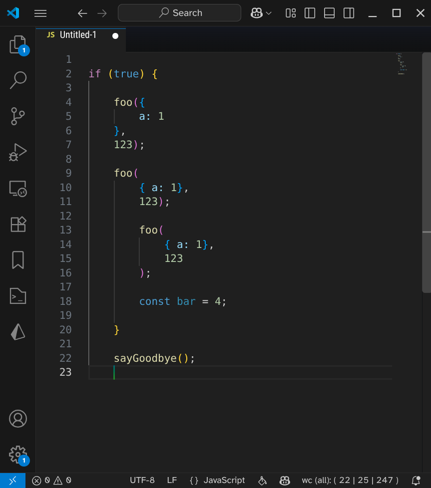
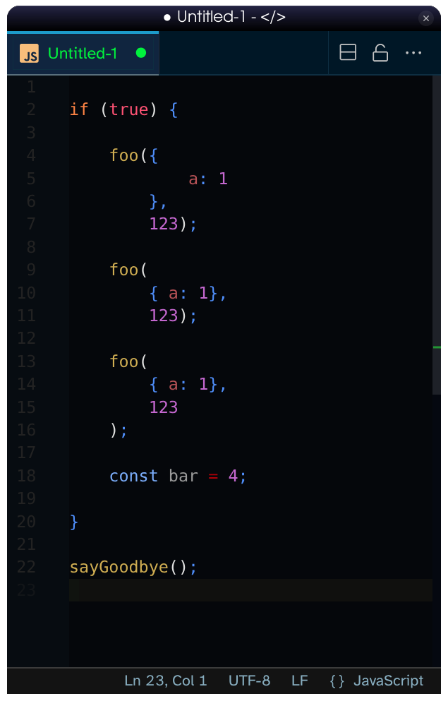

# VSCode Extension: Sane-indentation

https://marketplace.visualstudio.com/items?itemName=cfritz.sane-indentation

Ports the long-term atom package of the same name to VS Code. Adds a new command `sane-indentation.indentLine` (Sanely indent lines) which uses a tree-sitter parse tree to suggest the most sane indentation for it. This is independent of previous lines.

### Comparison

Here is a code snippet that shows how horrifically wrong the VSCode native indentation is. The issue with it is that it is purely inductive: the indentation of a line *only* depends on the indentation of the previous line and the content of these lines. But this cannot be made consistent. See for yourself.

#### VSCode without sane-indentation:

The issue is that the indentation keeps increasing just because of the way the parameters to `foo` are provided -- even though they are the same in all three cases!

#### Sane-indentation:

Sane-indentation solves this by computing the *absolute* indentation of a line based on the parse-tree of the entire file. This prevents inconsistencies in the indentation logic itself. It also means that small indendation mistakes left by the user do not escalate into more indentation issues below.

